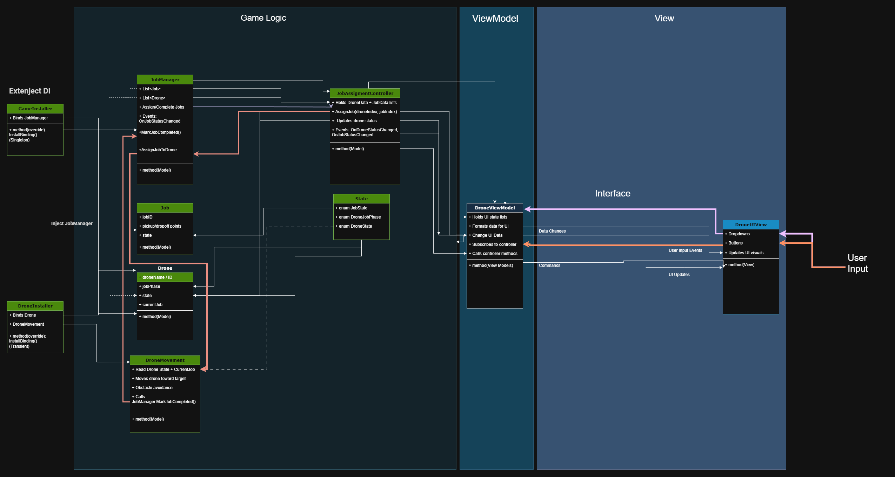
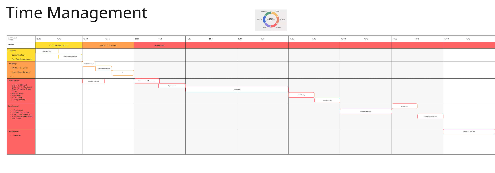
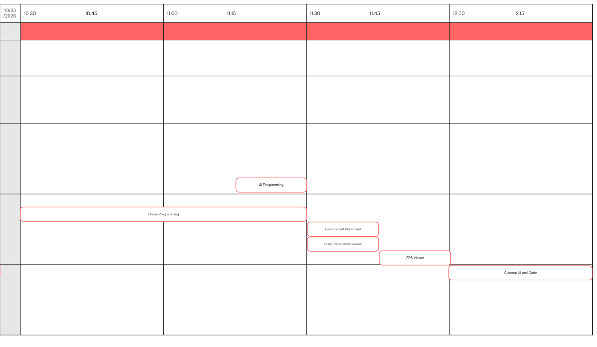
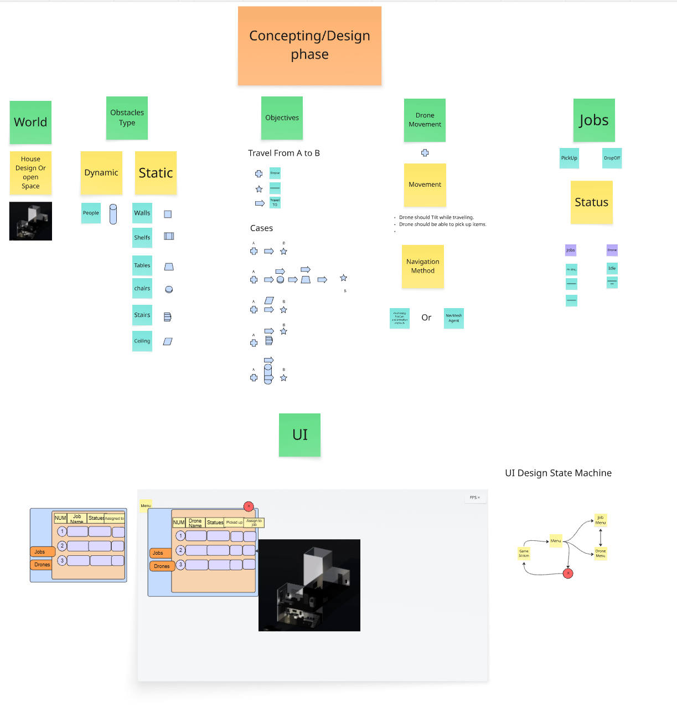
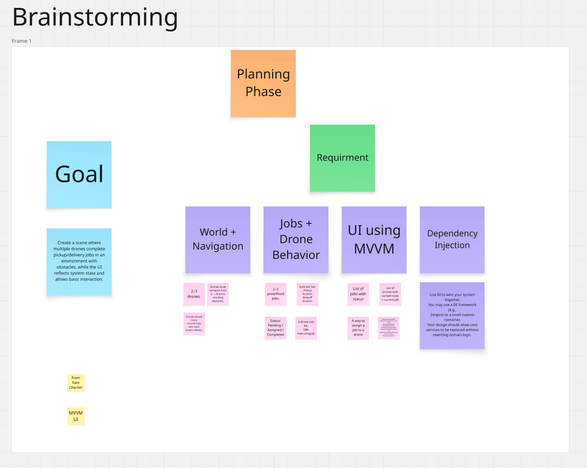

#  - How to run
##  - Run The Game 
- Click here to download the Folder of the game:
- [Open Game To Test folder](https://github.com/Osled/VRelax/tree/main/GameToTest)
- this file includes the executable of the playable Drone Assignment.

##  - Dependancies 
 Using Zenject (Extenject) as a Dependancy Injector	

##  - Run The Unity File

- Link :  https://assetstore.unity.com/packages/tools/utilities/extenject-dependency-injection-ioc-157735 

- High-level architecture overview (diagram or text)

- What you prioritised in 2–3 hours and why

-
- 
- What you would improve with more time

- Movement Drone
